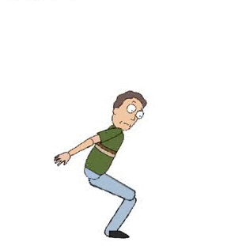

# Jerry Learns #
This simulation of Jerry Smith can be taught to walk or backflip using a NEAT genetic algorithm.

## Simulation ##
Jerry Learns uses [Pymunk](http://www.pymunk.org/en/latest/) for its physics simulation and [Pygame](https://www.pygame.org)
 for graphics. Each joint is simulated as a pivot constraint, rotary limit, and a motor to provide motion. 
 
## Evolution ##
Jerry's brain is simulated with a simple neural network that takes his current body state and outputs the desired torque
for each of his joints. [NEAT-python](http://neat-python.readthedocs.io/en/latest/) generates a population of neural 
networks and evolves them over time.

## Creating New Behaviors ##
In order to create a behavior of your own, extend the Config class. This class is responsible for returning a fitness 
calculator, motion calculator, NEAT config, and starting joint angles.
